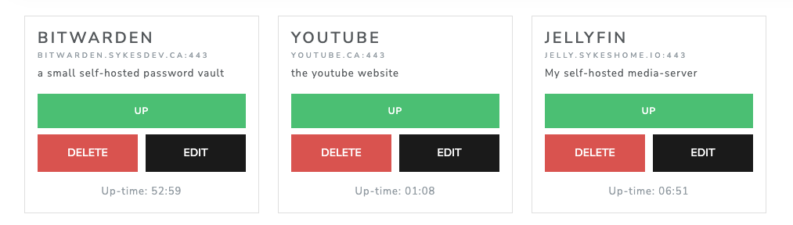

<p align="center">
  
  
  <hr/>
</p>

StayUp is a simple barebones uptime page for a configurable set of sites, web services and hosts in a local or remote deployment setting. Find full, detailed list of changes in our [CHANGELOG](/CHANGELOG.md)

<p align="center">
  
</p>

> Main screen showing primarily the latency graph which is updated in realtime for the past 2 minutes

<p align="center">
  
</p>

> Main screen showing an example of the service list which is also constantly up-to-date in real-time.

## Usage (with client)

Using docker-compose, execute the following to start up the required services on your host:

```bash
docker-compose up -d
```

> Note that the client code can be found [here](https://github.com/systemfiles/stay-up-client)

## Usage (only API server)

It is required that you have a running postgres database that the stayup server can write to. Modify the settings in a file (`.env`) or through environment variables.

### Available Options

*NOTE* - These options are also set in the `docker-compose.yml` file and can be modified there for use of that deployment method

- `ALLOWED_ORIGINS` : Comma-separated list of allowed origins able to connect and request data from this server. Configures CORS
- `DB_HOST` : Hostname or IP Address for the postgres database server that you wish for StayUp to use
- `DB_PORT` : Port that is open for StayUp to connect to the `DB_HOST`
- `DB_USER` : The user which has permissions to connect, read, write and update data for StayUp within the selected host database
- `DB_PASS` : Password for `DB_USER`
- `SERVICE_REFRESH_TIME_MS` : The frequency that the StayUp server will check service reachability + record latency and uptime.

```bash
# download dependencies
go mod download

# build server executable
go build -o ./build/stayup

# now start the server by simply executing the binary
./build/stayup
```